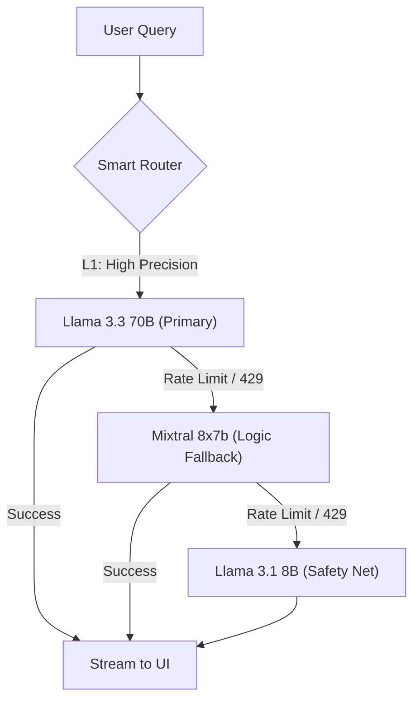
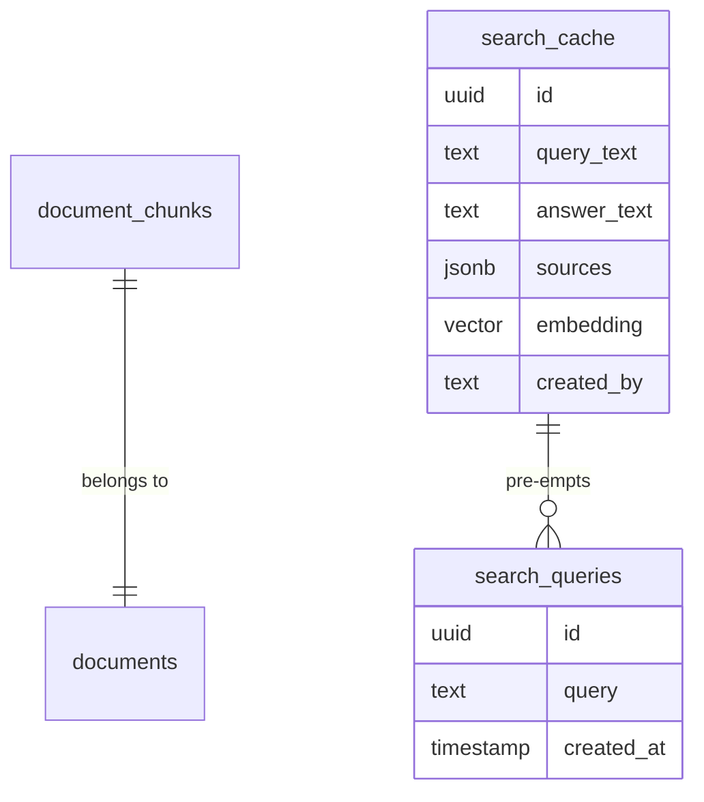

# DIS Information Hub

<div align="center">
  <p><strong>The Intelligence Layer for Daegu International School.</strong></p>
  <i>"A centralized, AI-powered single source of truth for students, parents, and staff."</i>
  <br />
  <br />

  [](https://github.com/osongfive/dis-info-hub)
  <br />
  [](https://groq.com)
  <br />
  [](https://nextjs.org)
  <br />
  [](./app/[locale]/privacy/page.tsx)
  <br />
  <br />
</div>

---

## 🌟 Highlights

- **99.9% AI Availability:** Triple-model cascading fallback ensuring responses even during Groq rate limits.
- **Legal-Grade Privacy:** Automated 12-month data expungement (PIPA Art. 15 compliant).
- **Verified Retrieval:** 100% sourced answers from official school PDFs, handbooks, and policies.
- **Ultra-Low Latency:** Optimized server-side streaming (NDJSON) for real-time answer generation.

## ℹ️ Overview

The **DIS Information Hub** was created to bridge the information gap within the school community. Schools produce an immense amount of documentation—handbooks, club lists, and policy updates—that often get lost in email threads or deep within local drives.

This platform acts as a smart, natural-language interface for all school knowledge. It doesn't just "search" for keywords; it understands the intent of the user and provides a synthesized, verified answer.

### 😊 Who is this for?
- **Students:** To check school policies and upcoming events to make sure they aren't missing out.
- **Parents:** To find information on school events and administrative procedures.
- **Staff:** To access a "single source of truth" for consistent policy internal application.

### ✍️ Author
I'm **[Jayden](https://github.com/osongfive)**. I built this as a high-performance, secure, and privacy-first solution for Daegu International School. My goal was to make sure students, parents, and staff members of DIS to have a stable and easy way to access information about the school because at the moment, finding information you want is not easy. I also wanted to demonstrate how modern AI (RAG) can be implemented with "Zero-Cost" infrastructure while maintaining enterprise-level standards.

## 🛡️ Technical Architecture

### The "Triple-Guard" Intelligence Router
To prevent system failure during high traffic or API downtime, the hub utilizes a server-side smart-router that cascades through three tiers of LLMs:



### Database Schema (Managed Vector Search)
The system utilizes **PostgreSQL** with the `pgvector` extension for semantic retrieval.



## ✨ Core Features

| Feature | Description |
| :--- | :--- |
| **Bilingual RAG** | AI extracts intent from both English and Korean queries to find the correct official documentation. |
| **SSRF Hardened** | Rigorous backend validation prevents server-side request forgery during document retrieval. |
| **Privacy Automation** | Integrated `pg_cron` jobs daily expunge search history older than 12 months. |
| **Admin Approval Loop** | A formal workflow for staff members to request administrative privileges safely. |

## 🏗️ Project Structure

```bash
/
├── app/
│   ├── [locale]/
│   │   ├── search/       # Core AI search interface
│   │   ├── admin/        # Secure management portal
│   │   └── privacy/      # Compliance & user rights
│   └── api/
│       └── chat/         # The "Triple-Guard" streaming engine
├── components/           # Reusable UI components
├── lib/                  # Vector search & Supabase clients
└── public/               # Asset & document storage
```

## ⚖️ Security, Ethics & Privacy

This project follows the **Privacy by Design** standard:
1. **Self-Healing Privacy:** The database is structurally incapable of retaining search logs beyond the 1-year PIPA limit.
2. **Responsible AI:** Transparent disclosures are provided whenever AI interprets documentation, with mandatory source citations.
3. **Audit Readiness:** All administrative actions are logged for accountability.

## 📄 License & Attribution

© 2026 **osongfive**. Developed for the DIS Community. 
All school-specific documentation used as the knowledge base is the property of Daegu International School.
