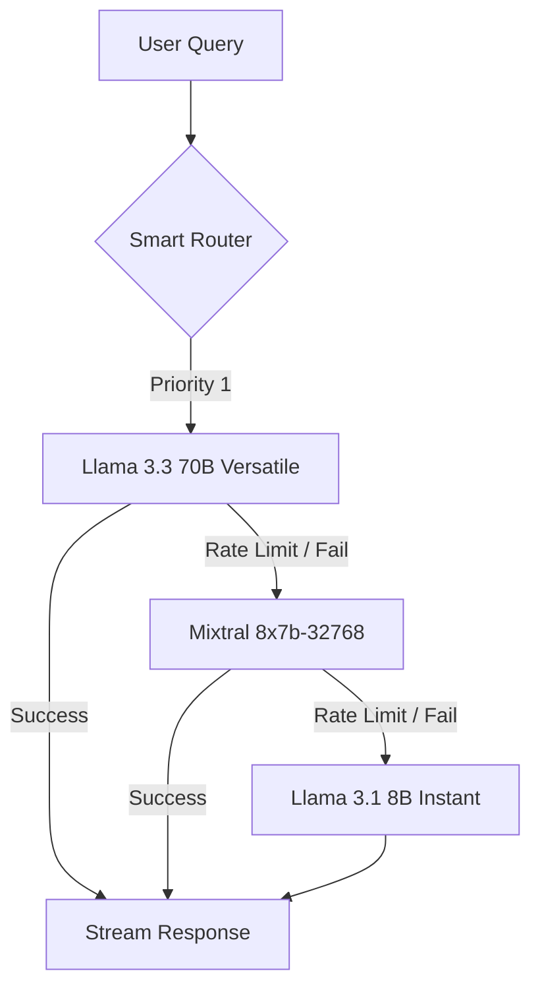

# DIS Information Hub

<div align="center">
  <p><strong>A centralized, AI-powered "Single Source of Truth" for the Daegu International School community.</strong></p>

  <p>
    <a href="https://nextjs.org">
      
    </a>
    <a href="https://supabase.com">
      
    </a>
    <a href="https://groq.com">
      
    </a>
    <a href="https://typescriptlang.org">
      
    </a>
  </p>
</div>

---

## 📖 Overview

The **DIS Information Hub** solves the problem of information fragmentation in a school environment. Instead of navigating dozens of PDF handbooks or searching through email archives, students and staff can query the school's official documentation in natural language and receive instant, sourced answers.

## 🛡️ "Triple-Guard" Smart Router

To ensure 99.9% availability and high-reasoning accuracy even under high traffic, this platform implements a unique server-side model cascading system:



## ✨ Key Capabilities

| Feature | Technical Implementation |
| :--- | :--- |
| **Semantic Search** | Retrieval-Augmented Generation (RAG) using `pgvector` and MiniLM-L6-v2 embeddings. |
| **Bilingual Support** | Server-side translation logic for consistent English-indexing retrieval regardless of query language. |
| **Real-time UX** | NDJSON streaming for a "typing" effect, giving immediate visual feedback to users. |
| **Privacy Compliance** | Automated daily data expungement (PIPA compliant) using `pg_cron` database triggers. |
| **Admin Controls** | Secure dashboard for content indexing, resource management, and audit logs. |

## 🛠️ Technical Stack

- **Framework:** [Next.js 15](https://nextjs.org/) (App Router)
- **Database:** [Supabase](https://supabase.com/) (PostgreSQL + pgvector)
- **Inference:** [Groq Cloud](https://groq.com/) (Ultra-low latency LLM provider)
- **Vector Embeddings:** [Hugging Face](https://huggingface.co/) (In-memory transformer processing)
- **Styling:** Vanilla CSS + Tailwind (where necessary)
- **Deployment:** Vercel

## 🚀 Getting Started

### Prerequisites
- Node.js 18.x or later
- A Supabase project with `pgvector` and `pg_cron` enabled
- API keys for Groq, HuggingFace, and Resend

### Installation

1. **Clone the repository:**
   ```bash
   git clone https://github.com/osongfive/dis-info-hub.git
   cd dis-info-hub
   ```

2. **Install dependencies:**
   ```bash
   npm install
   ```

3. **Environment Setup:**
   Copy the example environment file and fill in your keys:
   ```bash
   cp .env.example .env.local
   ```

4. **Run locally:**
   ```bash
   npm run dev
   ```

## ⚖️ Security & Privacy

This platform was built with a strict "Privacy by Design" philosophy to comply with **South Korea's Personal Information Protection Act (PIPA)** and **COPPA**:

- **Automated Data Lifecycle:** All search queries and cache entries are automatically deleted from the database after **12 months**.
- **Data Minimization:** We only log query text for search improvement; no personal identification is linked to search logs in the public tier.
- **Secure Access:** Administrative features are protected by robust RBAC (Role-Based Access Control).

## 📄 License & Attribution

Built with ❤️ for Daegu International School by **osongfive**.

All rights reserved to Daegu International School for the official documentation contents within the system. Code is subject to the project's internal licensing.
